# XYZPan DSP Signal Processing Pipeline
# INSTRUCTIONS FOR CLAUDE: After every edit within this file, re-render the .html file that corresponds to this md file in the docs folder.

```mermaid
flowchart TD
    classDef input fill:#2d5016,stroke:#4a8c2a,color:#fff
    classDef position fill:#1a3a5c,stroke:#2a6a9e,color:#fff
    classDef binaural fill:#5c1a1a,stroke:#9e2a2a,color:#fff
    classDef body fill:#4a3520,stroke:#8a6540,color:#fff
    classDef distance fill:#3a1a5c,stroke:#6a2a9e,color:#fff
    classDef reverb fill:#1a4a4a,stroke:#2a8a8a,color:#fff
    classDef output fill:#333,stroke:#666,color:#fff
    classDef split fill:#5c5c1a,stroke:#9e9e2a,color:#fff
    classDef stereo fill:#1a3a3a,stroke:#2a7a7a,color:#fff

    %% ═══════════════════════════════════════
    %% INPUT
    %% ═══════════════════════════════════════
    INPUT["Stereo Input L / R"]:::input
    MONO_SUM["Mono Sum: 0.5 x L+R<br/><i>fallback when width = 0</i>"]:::input
    INPUT --> MONO_SUM

    %% ═══════════════════════════════════════
    %% POSITION MODULATION
    %% ═══════════════════════════════════════
    subgraph POS["POSITION MODULATION  per-sample"]
        direction TB
        LFO_MOD["Position LFOs X, Y, Z<br/><i>6 waveforms - rate - depth - phase</i><br/><i>tempo sync - speed multiplier</i>"]:::position
        LISTENER_SUB["Listener Position Subtraction<br/><i>walker mode: world to listener-relative</i>"]:::position
        HEAD_ROT["Listener Head Rotation<br/><i>Yaw then Pitch then Roll inverse</i><br/><i>per-sample trig interpolation</i><br/><i>driven by: listenerYaw/Pitch/Roll</i>"]:::position
        LFO_MOD --> LISTENER_SUB --> HEAD_ROT
    end
    MONO_SUM --> POS

    %% ═══════════════════════════════════════
    %% STEREO NODE SPLIT (conditional)
    %% ═══════════════════════════════════════
    subgraph STEREO_SPLIT["STEREO SOURCE NODE SPLITTING  when width > 0"]
        direction TB
        ORBIT_LFO["Orbit LFOs XY, XZ, YZ planes<br/><i>3 independent LFOs per plane</i><br/><i>angular smoothers for phase wrap</i>"]:::stereo
        SPREAD_DIR["Spread Direction<br/><i>faceListener: perpendicular to listener-source</i><br/><i>standard: along X axis</i>"]:::stereo
        NODE_OFFSET["L/R Node Offset Computation<br/><i>XY orbit then XZ orbit then YZ orbit</i><br/><i>pi phase difference between L and R</i>"]:::stereo
        NODE_POS["Per-Node Distance and Rotation<br/><i>independent listener-relative coords</i><br/><i>independent head rotation per node</i>"]:::stereo
        ORBIT_LFO --> SPREAD_DIR --> NODE_OFFSET --> NODE_POS
    end
    POS --> STEREO_SPLIT

    %% ═══════════════════════════════════════
    %% SPLIT INTO L/R NODE PATHS
    %% ═══════════════════════════════════════
    SPLIT_POINT{"Signal splits into<br/>L-node and R-node paths<br/>or single mono path"}:::split
    STEREO_SPLIT --> SPLIT_POINT

    %% ═══════════════════════════════════════
    %% PER-NODE PROCESSING
    %% ═══════════════════════════════════════

    subgraph PER_NODE["PER-NODE PROCESSING  x1 mono or x2 stereo"]
        direction TB

        %% --- DOPPLER ---
        subgraph DOPPLER["DOPPLER DELAY  applied first"]
            direction TB
            DOP_DELAY["Fractional Delay Line<br/><i>Cubic Hermite (Catmull-Rom) interpolation</i><br/><i>delay = distance x speedOfSound</i><br/><i>rate-limited by distDelaySmooth</i><br/><i>driven by: rawNodeDistFrac</i><br/><i>Hermite acts as natural reconstruction filter</i>"]:::distance
        end

        %% --- BINAURAL PIPELINE ---
        subgraph BINAURAL["BINAURAL PIPELINE  virtual ear distance-difference model"]
            direction TB

            subgraph VIRT_EARS["Virtual Ear Spatial Cues"]
                VEAR["3-Axis Distance-Difference Model<br/><i>L/R ears at +/-h,0,0 → azimuthFactor -1..+1</i><br/><i>F/B ears at 0,+/-h,0 → rearFactor -1..+1</i><br/><i>T/B ears at 0,0,+/-h → elevFactor 0..1</i><br/><i>h = 0.087 per axis, no singularities</i>"]:::binaural
            end

            subgraph COMB_BANK["DEPTH: Comb Filter Bank  [F/B rear only]"]
                COMBS["10x Feedback Combs in Series<br/><i>delays: 0.21 to 1.50 ms</i><br/><i>feedback: 0.13 to 0.16 clamped +/-0.95</i><br/><i>wetMax: 15% at rear, 0% at front</i><br/><i>driven by: rearFactor from F/B virtual ears</i><br/><i>adds metallic coloration for rear sources</i>"]:::binaural
            end

            subgraph PINNA_EQ["ELEVATION: Mono EQ Chain  10 bands"]
                direction TB
                EQ1["Presence Shelf - 3kHz - +/-1dB default [F/B]<br/><i>high shelf attenuates rear sources</i><br/><i>front: +1dB - behind: -1dB (tunable 0-12dB)</i><br/><i>driven by: presenceShelfMaxDb x -rearFactor</i><br/><i>ref: Blauert 1969, Algazi+ 2001</i>"]:::binaural
                EQ2["Ear Canal Peak - 2.7kHz - 0/-4dB - Q=2.0 [F/B]<br/><i>models reduced ear canal resonance for rear sources</i><br/><i>clamped to 0dB max - only cuts, never boosts</i><br/><i>driven by: -rearFactor, clamped le 0</i><br/><i>ref: Shaw 1974, Stinson+ 1989</i>"]:::binaural
                EQ3["Shoulder Peak - 1.5kHz - +2dB - Q=1.0 [T/B below]<br/><i>models shoulder reflection for sound from below</i><br/><i>above: 0dB - below: +2dB</i><br/><i>driven by: inverted elevFactor (belowFactor = 1 - elevFactor)</i><br/><i>Expanded Pinna only</i><br/><i>ref: Algazi+ 2001, 2002</i>"]:::binaural
                EQ4["Concha Notch - 4kHz - -8dB - Q=3.0 [T/B below]<br/><i>ear bowl creates deep notch for sounds below ear level</i><br/><i>above: 0dB - below: -8dB</i><br/><i>key brain cue for below vs above</i><br/><i>driven by: inverted elevFactor - Expanded Pinna only</i><br/><i>ref: Shaw 1997, Lopez-Poveda+ 1996</i>"]:::binaural
                EQ5["Pinna P1 Peak - 5kHz - +2.8dB - Q=1.5 [FIXED]<br/><i>constant pinna resonance regardless of direction</i><br/><i>set once, never modulated</i><br/><i>ref: Mokhtari+ 2015, Shaw 1997</i>"]:::binaural
                EQ6["Pinna N1 Notch - 6.5k to 10kHz - Q=2.0 [T/B]<br/><i>PRIMARY elevation cue - both freq and gain shift</i><br/><i>freq: 6.5kHz below to 10kHz above</i><br/><i>gain: -15dB below to +5dB above (notch becomes peak)</i><br/><i>driven by: elevFactor</i><br/><i>ref: Raykar+ 2005, Iida+ 2007, Hebrank+ 1974</i>"]:::binaural
                EQ7["Pinna N2 Notch - N1+3kHz - -8dB - Q=2.0 [FIXED gain, T/B freq]<br/><i>secondary harmonic 3kHz above N1 (9.5 to 13kHz)</i><br/><i>fixed -8dB depth, freq tracks N1 via elevFactor</i><br/><i>ref: Raykar+ 2005</i>"]:::binaural
                EQ8["Upper Pinna - 12kHz - -4/+3dB - Q=2.0 [T/B]<br/><i>models upper ear fold scattering</i><br/><i>below: -4dB - ear level: -0.5dB - above: +3dB</i><br/><i>driven by: elevFactor - Expanded Pinna only</i><br/><i>ref: Shaw 1997 modes 4-6, Hebrank+ 1974</i>"]:::binaural
                EQ9["Tragus Notch - 8.5kHz - -5dB - Q=3.5 [F/B + T/B]<br/><i>DUAL-AXIS: only when BOTH behind AND below</i><br/><i>tragus cartilage blocks HF from rear-below</i><br/><i>gain = tragusMax x max(0,rearFactor) x belowFactor</i><br/><i>Expanded Pinna only</i><br/><i>ref: Takemoto+ 2012, Shaw 1997</i>"]:::binaural
                EQ10["Pinna High Shelf - 4kHz - 0/+3dB [T/B]<br/><i>pinna collects HF from above more efficiently</i><br/><i>below: 0dB - horizon+: +3dB</i><br/><i>driven by: elevFactor x 2 clamped to 1</i><br/><i>ref: Shaw 1997, Hebrank+ 1974</i>"]:::binaural
                EQ1 --> EQ2 --> EQ3 --> EQ4 --> EQ5 --> EQ6 --> EQ7 --> EQ8 --> EQ9 --> EQ10
            end

            subgraph ITD_ILD["BINAURAL SPLIT to L/R Ears"]
                direction TB
                ITD["ITD: Interaural Time Difference [L/R]<br/><i>delays far ear by up to 0.72ms (5ms creative)</i><br/><i>brain's primary horizontal cue at low frequencies</i><br/><i>smoothing: 8ms to prevent pitch artifacts</i><br/><i>driven by: azimuthFactor from L/R virtual ears</i>"]:::binaural
                ILD["ILD: Interaural Level Difference [L/R]<br/><i>attenuates far ear: 0 to 4.5dB</i><br/><i>crossfade at median plane 4 samples</i><br/><i>brain's primary horizontal cue at high frequencies</i><br/><i>driven by: azimuthFactor from L/R virtual ears</i>"]:::binaural
                NF["Near-Field LF Boost [L/R + dist]<br/><i>LowShelf biquad at 200Hz</i><br/><i>+/-6dB per ear - ipsilateral only</i><br/><i>bass wraps around head unevenly when close</i><br/><i>driven by: azimuthFactor x proximity</i>"]:::binaural
                HS["Head Shadow [L/R far ear]<br/><i>SVF LPF: 16kHz open to 1.2kHz hard pan</i><br/><i>HF cannot diffract around head - far ear darkens</i><br/><i>TPT topology - per-sample safe</i><br/><i>driven by: azimuthFactor - asymmetric per ear</i>"]:::binaural
                RS["Rear Shadow [F/B rear both ears]<br/><i>SVF LPF: 22kHz open to 20kHz behind</i><br/><i>subtle HF absorption for rear sources</i><br/><i>driven by: rearFactor from F/B virtual ears</i>"]:::binaural
                HP["Hardpan Compensation [L/R]<br/><i>far-ear attenuation up to 4dB</i><br/><i>compensates for disabled ITD</i><br/><i>active only when binauralEnabled = OFF</i><br/><i>driven by: azimuthFactor, crossfaded by 1-binBlend</i>"]:::binaural
                ITD --> HP --> ILD --> NF --> HS --> RS
            end

            VIRT_EARS --> COMB_BANK --> PINNA_EQ --> ITD_ILD
        end

        %% --- BODY REFLECTIONS (parallel) ---
        subgraph BODY["BODY REFLECTIONS  parallel paths, added to both ears"]
            direction LR

            subgraph CHEST["CHEST BOUNCE [T/B below]"]
                direction TB
                CH_HPF["4x SVF HPF at 700Hz<br/><i>24dB/oct rolloff - removes rumble</i>"]:::body
                CH_LPF["1x OnePole LPF at 1kHz<br/><i>6dB/oct chest absorption</i>"]:::body
                CH_DELAY["Fractional Delay: 0 to 2ms [T/B below]<br/><i>models sound bouncing off listener's chest</i><br/><i>above: 0ms - below: 2ms</i><br/><i>driven by: inverted elevFactor</i>"]:::body
                CH_GAIN["Gain: -8dB [T/B below]<br/><i>above: 0dB - below: -8dB</i><br/><i>driven by: inverted elevFactor</i>"]:::body
                CH_HPF --> CH_LPF --> CH_DELAY --> CH_GAIN
            end

            subgraph FLOOR["FLOOR BOUNCE [T/B below]"]
                direction TB
                FL_DELAY["Stereo Fractional Delays [T/B below]<br/><i>0 to 20ms - models floor reflection path</i><br/><i>longer delay + LPF = ground-level perception</i><br/><i>driven by: inverted elevFactor</i>"]:::body
                FL_LPF["L/R OnePole LPF at 5kHz<br/><i>floor material HF absorption</i>"]:::body
                FL_GAIN["Gain: -5dB [T/B below]<br/><i>above: 0dB - below: -5dB</i><br/><i>driven by: inverted elevFactor</i>"]:::body
                FL_DELAY --> FL_LPF --> FL_GAIN
            end
        end

        %% --- DISTANCE PROCESSING ---
        subgraph DIST["DISTANCE PROCESSING"]
            direction TB
            DIST_GAIN["Distance Gain Attenuation<br/><i>compressed cubic Hermite spline</i><br/><i>floor: -72dB - ceiling: +6dB</i><br/><i>steepness slider: flat to cliff</i><br/><i>smoothing: 150ms</i><br/><i>driven by: modDistFrac</i>"]:::distance
            AIR1["Air Absorption Stage 1<br/><i>OnePole LPF: 22kHz to 8kHz</i><br/><i>driven by: distance fraction</i>"]:::distance
            AIR2["Air Absorption Stage 2<br/><i>OnePole LPF: 22kHz to 12kHz</i><br/><i>cascade = 12dB/oct total</i><br/><i>driven by: distance fraction</i>"]:::distance
            DIST_GAIN --> AIR1 --> AIR2
        end

        %% --- EARLY REFLECTIONS ---
        subgraph ER["EARLY REFLECTIONS  Image Source Method"]
            direction TB
            ER_DESC["6 Virtual Wall Reflections +/-X, +/-Y, +/-Z<br/><i>each reflection has:</i>"]:::reverb
            ER_WALL["Wall Absorption LPF<br/><i>500Hz damped to 16kHz undamped</i><br/><i>driven by: erDamping</i>"]:::reverb
            ER_PINNA["Pinna EQ per Tap - 9 bands<br/><i>same chain as direct sound minus fixed P1 peak</i><br/><i>presence shelf - ear canal - shoulder - concha</i><br/><i>N1 notch - N2 notch - upper pinna - tragus - shelf</i><br/><i>driven by: image source elevation + rear factor</i><br/><i>coefficients set per-block</i>"]:::reverb
            ER_BIN["Full Binaural per Tap<br/><i>ITD + ILD + near-field LF + head shadow + rear shadow</i><br/><i>driven by: image source 3D direction</i>"]:::reverb
            ER_DELAY["Image Source Delay<br/><i>speed of sound: 343 m/s</i><br/><i>room size: 1 to 30m</i>"]:::reverb
            ER_OUT{"ER Output Split"}:::split
            ER_DIRECT["Direct Output x erLevel"]:::reverb
            ER_SEND["Reverb Send x erReverbSend"]:::reverb
            ER_DESC --> ER_WALL --> ER_PINNA --> ER_BIN --> ER_DELAY --> ER_OUT
            ER_OUT --> ER_DIRECT
            ER_OUT --> ER_SEND
        end

        %% Internal flow
        DOPPLER --> BINAURAL
        BINAURAL --> BODY
        BINAURAL --> DIST
        BODY --> DIST
        DIST --> ER
    end

    SPLIT_POINT --> PER_NODE

    %% ═══════════════════════════════════════
    %% STEREO COMBINATION
    %% ═══════════════════════════════════════
    STEREO_COMBINE["Stereo Node Combine<br/><i>dL = dL_L + dL_R x -3dB</i><br/><i>dR = dR_L + dR_R x -3dB</i><br/><i>distFrac = avg L, R</i>"]:::stereo

    PER_NODE --> STEREO_COMBINE

    %% ═══════════════════════════════════════
    %% AUX SEND
    %% ═══════════════════════════════════════
    subgraph AUX["AUX REVERB SEND  optional bus"]
        direction TB
        AUX_DELAY["Pre-Delay L/R<br/><i>distance-scaled</i><br/><i>max: verbPreDelayMax ms</i>"]:::reverb
        AUX_GAIN["Proximity Gain Boost<br/><i>1.0 to auxMaxBoostLin +6dB</i><br/><i>driven by: distance fraction</i>"]:::reverb
        AUX_OUT["Aux Output L/R<br/><i>clamped +/-2.0</i>"]:::reverb
        AUX_DELAY --> AUX_GAIN --> AUX_OUT
    end

    %% ═══════════════════════════════════════
    %% FDN REVERB
    %% ═══════════════════════════════════════
    subgraph REVERB["FDN REVERB  Dattorro Plate"]
        direction TB
        REV_PRE["Pre-Delay<br/><i>distance-scaled: distFrac x maxPreDelay</i>"]:::reverb
        subgraph REV_INPUT["Input Diffusion  series"]
            direction LR
            AP1["AllPass 1<br/><i>142 samp - coeff 0.75</i>"]:::reverb
            AP2["AllPass 2<br/><i>107 samp - coeff 0.75</i>"]:::reverb
            AP3["AllPass 3<br/><i>379 samp - coeff 0.625</i>"]:::reverb
            AP4["AllPass 4<br/><i>277 samp - coeff 0.625</i>"]:::reverb
            AP1 --> AP2 --> AP3 --> AP4
        end
        subgraph REV_TANK["Figure-8 Tank  feedback loop"]
            direction TB
            TANK_AP1["Modulated AllPass 1<br/><i>672 samp - LFO at 1.0Hz</i>"]:::reverb
            TANK_DL1["Tank Delay 1<br/><i>4453 samp</i>"]:::reverb
            TANK_DAMP1["One-Pole Damping LPF"]:::reverb
            TANK_AP2["Modulated AllPass 2<br/><i>908 samp - LFO at 0.87Hz</i>"]:::reverb
            TANK_DL2["Tank Delay 2<br/><i>4217 samp</i>"]:::reverb
            TANK_DAMP2["One-Pole Damping LPF"]:::reverb
            TANK_AP1 --> TANK_DL1 --> TANK_DAMP1 --> TANK_AP2 --> TANK_DL2 --> TANK_DAMP2 --> TANK_AP1
        end
        REV_TAPS["6-Tap Decorrelated Output<br/><i>Early A: +266 samp from each tank</i><br/><i>Late B: +2974 samp from each tank</i><br/><i>Cross C: -1913 samp swapped</i>"]:::reverb
        REV_DC["DC Blocker ~5Hz HPF per channel"]:::reverb
        REV_WET["Wet/Dry Mix<br/><i>driven by: verbWet 0 to 1</i><br/><i>CPU-gated when wet less than 1e-6</i>"]:::reverb
        REV_PRE --> REV_INPUT --> REV_TANK --> REV_TAPS --> REV_DC --> REV_WET
    end

    %% Connect to reverb
    STEREO_COMBINE --> AUX
    STEREO_COMBINE --> REVERB
    ER_SEND -.->|"erReverbAccum<br/>feeds reverb input"| REVERB

    %% ═══════════════════════════════════════
    %% OUTPUT
    %% ═══════════════════════════════════════
    OUTPUT_CLAMP["Output Clamp +/-2.0<br/><i>outL = clamp dry + wetReverb</i><br/><i>outR = clamp dry + wetReverb</i>"]:::output
    DSP_STATE["DSP State Snapshot to UI<br/><i>itdSamples, shadowHz, ildGain</i><br/><i>distDelay, distGain, airCutoff</i><br/><i>LFO outputs for waveform display</i>"]:::output

    REVERB --> OUTPUT_CLAMP
    OUTPUT_CLAMP --> DSP_STATE
    AUX_OUT --> FINAL_OUT["Stereo Output L/R<br/>+ Optional Aux Bus L/R"]:::output
    OUTPUT_CLAMP --> FINAL_OUT
```

## What Drives Each Stage

| Stage | Axis | Primary Driver | Range | Condition | Sources |
|-------|------|---------------|-------|-----------|---------|
| Position LFOs | — | Rate/depth/phase params | Per-axis modulation | Always | — |
| Head Rotation | — | Yaw/pitch/roll params | Full rotation | Linked instances | — |
| Stereo Split | — | stereoWidth param | 0 (mono) to 1 (full split) | width > 0 | — |
| Doppler Delay | **DIST** | rawNodeDistFrac | 0 to distDelayMaxMs | Bypassable | Neuhoff 2001; Oechslin+ 2008 |
| Virtual Ears | — | 3D position (listener-relative) | azimuth/rear: -1..+1, elev: 0..1 | Always | Algazi+ 2002 |
| Comb Bank | **F/B** | rearFactor (rear only, ≥0) | 0% front to 15% behind | Rear sources only | Batteau 1967; Takemoto+ 2012 |
| Presence Shelf 3k | **F/B** | -rearFactor | -1 to +1 dB (default, tunable 0-12) | Always | Blauert 1969/1997; Algazi+ 2001 |
| Ear Canal 2.7k | **F/B** | -rearFactor (clamped ≤0) | -4 to 0 dB | Always | Shaw 1974; Stinson+ 1989 |
| Shoulder 1.5k | **T/B** | inverted elevFactor (below) | 0 to +2 dB | Expanded Pinna only | Algazi+ 2001, 2002; Brown+ 1998 |
| Concha 4k | **T/B** | inverted elevFactor (below) | 0 to -8 dB | Expanded Pinna only | Shaw 1997; Lopez-Poveda+ 1996 |
| P1 Peak 5k | **FIXED** | constant | +2.8 dB always | Always | Mokhtari+ 2015; Shaw 1997 |
| N1 Notch 6.5→10k | **T/B** | elevFactor (freq + gain) | freq sweep, -15 to +5 dB | Always | Raykar+ 2005; Iida+ 2007; Hebrank+ 1974 |
| N2 Notch N1+3k | **FIXED/T/B** | freq via N1, gain fixed | -8 dB, 9.5→13 kHz | Always | Raykar+ 2005 |
| Upper Pinna 12k | **T/B** | elevFactor | -4 to +3 dB | Expanded Pinna only | Shaw 1997 modes 4-6; Hebrank+ 1974 |
| Tragus 8.5k | **F/B + T/B** | rearFactor × belowFactor | 0 to -5 dB | Expanded Pinna, rear+below | Takemoto+ 2012; Shaw 1997 |
| Pinna Shelf 4k | **T/B** | elevFactor × 2 (clamped) | 0 to +3 dB | Always | Shaw 1997; Hebrank+ 1974 |
| ITD | **L/R** | azimuthFactor | ±0.72 ms (up to 5 ms) | Bypassable, ×binBlend (0 when binaural OFF) | Kuhn 1977; Woodworth 1938; Strutt 1907 |
| Hardpan Compensation | **L/R** | azimuthFactor × (1-binBlend) | 0 to -4 dB far ear | binBlend < 1 (binaural OFF) | — |
| ILD | **L/R** | azimuthFactor | 0 to 4.5 dB | Bypassable, crossfaded | Shaw 1974; Mills 1960 |
| Near-Field LF | **L/R + DIST** | azimuthFactor × proximity | 0 to ±6 dB | Bypassable | Brungart+ 1999; Duda+ 1998 |
| Head Shadow | **L/R** | azimuthFactor (far ear) | 16→1.2 kHz LPF | Bypassable | Shaw 1974; Strutt 1907 |
| Rear Shadow | **F/B** | rearFactor (≥0, both ears) | 22→20 kHz LPF (subtle) | Bypassable | Batteau 1967; Musicant+ 1984 |
| Chest Bounce | **T/B** | inverted elevFactor | 0-2 ms delay, 0 to -8 dB | Bypassable | Algazi+ 2001, 2002 |
| Floor Bounce | **T/B** | inverted elevFactor | 0-20 ms delay, 0 to -5 dB | Bypassable | Behrens+ 2016; Algazi+ 2002 |
| Distance Gain | **DIST** | modDistFrac | -72 to +6 dB | Always | Zahorik+ 2005; Blauert 1997 |
| Air Absorption | **DIST** | distance fraction | 22→8 kHz + 22→12 kHz | Always | ISO 9613-1:1993; Xie+ 2021 |
| Early Reflections | — | Image source geometry | roomSize 1-30m | Bypassable | Allen+ 1979; Barron+ 1981 |
| FDN Reverb | — | Wet param + ER send | 0 to 100% wet | CPU-gated | Dattorro 1997; Jot+ 1991 |

## Processing Topology Notes

1. **Doppler is FIRST** -- applied before any spatial processing so pitch modulation propagates through reflections and reverb. Hermite interpolation acts as a natural reconstruction filter; no separate anti-aliasing LPF needed
2. **Binaural is MONO until ITD split** -- comb bank and pinna EQ run on mono signal, then ITD creates the L/R ear split
3. **Chest/Floor are PARALLEL to distance** -- body reflections branch from the binaural output and merge back before distance processing
4. **ER has a DUAL output** -- direct reflections add to main signal, reverb send feeds the FDN separately
5. **Stereo nodes are FULLY INDEPENDENT** -- when width > 0, the entire per-node chain (doppler - binaural - body - distance - ER) runs twice with independent positions, then combined at -3dB
6. **Reverb input = dry signal + ER reverb accumulator** -- the FDN receives both the processed direct signal and the ER reverb send
7. **All per-block transcendentals** (sin, cos, pow, sqrt, tan, exp) computed once per block, not per sample
8. **binauralEnabled toggles ITD only** — when OFF, ITD delay goes to zero and a hardpan compensation stage adds up to 4dB far-ear attenuation. All other binaural cues (head shadow, ILD, near-field, pinna EQ, combs, rear shadow) remain fully active. Individual bypass toggles control each stage independently

## Research Sources

Numbered references cited in the table and diagram above. "+" after first author indicates additional co-authors.

1. Algazi, V. R., Avendano, C., & Duda, R. O. (2001). "Elevation localization and head-related transfer function analysis at low frequencies." *JASA*, 109(3), 1110–1122.
2. Algazi, V. R., Duda, R. O., Duraiswami, R., Gumerov, N. A., & Tang, Z. (2002). "Approximating the head-related transfer function using simple geometric models of the head and torso." *JASA*, 112(5), 2053–2064.
3. Allen, J. B. & Berkley, D. A. (1979). "Image method for efficiently simulating small-room acoustics." *JASA*, 65(4), 943–950.
4. Avendano, C., Algazi, V. R., & Duda, R. O. (1999). "A head-and-torso model for low-frequency binaural elevation effects." *Proc. IEEE WASPAA*, New Paltz, NY, 179–182.
5. Barron, M. & Marshall, A. H. (1981). "Spatial impression due to early lateral reflections in concert halls." *J. Sound and Vibration*, 77(2), 211–232.
6. Batteau, D. W. (1967). "The role of the pinna in human localization." *Proc. Royal Society B*, 168, 158–180.
7. Baumgartner, R., Majdak, P., & Laback, B. (2014). "Modeling sound-source localization in sagittal planes for human listeners." *JASA*, 136(2), 791–802.
8. Behrens, T., Rébillat, M., & Música, R. (2016). "The influence of the floor reflection on the perception of sound elevation." *AES Convention*, Paper 9551.
9. Bernstein, L. R. & Trahiotis, C. (2002). "Enhancing sensitivity to interaural delays at high frequencies by using 'transposed stimuli.'" *JASA*, 112(3), 1026–1036.
10. Blauert, J. (1969). "Untersuchungen zum Richtungshören in der Medianebene bei fixiertem Kopf." *Acustica*, 22, 205–213. [Directional bands in the median plane.]
11. Blauert, J. (1997). *Spatial Hearing: The Psychophysics of Human Sound Localization.* MIT Press.
12. Borish, J. (1984). "Extension of the image model to arbitrary polyhedra." *JASA*, 75(6), 1827–1836.
13. Bronkhorst, A. W. & Houtgast, T. (1999). "Auditory distance perception in rooms." *Nature*, 397, 517–520.
14. Brown, C. P. & Duda, R. O. (1998). "A structural model for binaural sound synthesis." *IEEE Trans. Speech Audio Process.*, 6(5), 476–488.
15. Brungart, D. S. & Rabinowitz, W. M. (1999). "Auditory localization of nearby sources. Head-related transfer functions." *JASA*, 106(3), 1465–1479.
16. Dattorro, J. (1997). "Effect design, part 1: Reverberator and other filters." *J. Audio Eng. Soc.*, 45(9), 660–684.
17. Duda, R. O. & Martens, W. L. (1998). "Range dependence of the response of a spherical head model." *JASA*, 104(5), 3048–3058.
18. Gardner, M. B. & Gardner, R. S. (1973). "Problem of localization in the median plane: effect of pinnae cavity occlusion." *JASA*, 53(2), 400–408.
19. Gerzon, M. A. (1971). "Synthetic stereo reverberation." *AES Convention*.
20. Grothe, B., Pecka, M., & McAlpine, D. (2010). "Mechanisms of sound localization in mammals." *Physiological Reviews*, 90(3), 983–1012.
21. Hebrank, J. & Wright, D. (1974). "Spectral cues used in the localization of sound sources on the median plane." *JASA*, 56(6), 1829–1834.
22. Iida, K., Itoh, M., Itagaki, A., & Morimoto, M. (2007). "Median plane localization using a parametric model of the head-related transfer function based on spectral cues." *Applied Acoustics*, 68(8), 835–850.
23. ISO 9613-1:1993. "Acoustics — Attenuation of sound during propagation outdoors — Part 1: Calculation of the absorption of sound by the atmosphere."
24. Jeffress, L. A. (1948). "A place theory of sound localization." *J. Comparative and Physiological Psychology*, 41, 35–39.
25. Jot, J.-M. & Chaigne, A. (1991). "Digital delay networks for designing artificial reverberators." *AES Convention*.
26. Kan, A., Jin, C., & van Schaik, A. (2009). "A psychophysical evaluation of near-field head-related transfer functions synthesized using a distance variation function." *JASA*, 125(4), 2033–2042.
27. Kuhn, G. F. (1977). "Model for the interaural time differences in the azimuthal plane." *JASA*, 62, 157–167.
28. Kuttruff, H. (2009). *Room Acoustics*, 5th edition. Spon Press.
29. Lopez-Poveda, E. A. & Meddis, R. (1996). "A physical model of sound diffraction and reflections in the human concha." *JASA*, 100(5), 3248–3259.
30. Macaulay, E. J., Hartmann, W. M., & Rakerd, B. (2010). "The acoustical bright spot and mislocalization of tones by human listeners." *JASA*, 127(3), 1440.
31. Mills, A. W. (1960). "Lateralization of high-frequency tones." *JASA*, 32, 132–134.
32. Mokhtari, P., Takemoto, H., Adachi, S., Nishimura, R., & Kato, H. (2015). "Frequency and amplitude estimation of the first peak of head-related transfer functions from individual pinna anthropometry." *JASA*, 137(2), 690–701.
33. Morimoto, M. & Maekawa, Z. (1989). "Auditory spaciousness and envelopment." *Proc. 13th ICA*, Belgrade.
34. Musicant, A. D. & Butler, R. A. (1984). "The influence of pinnae-based spectral cues on sound localization." *JASA*, 75(4), 1195–1200.
35. Neuhoff, J. G. (2001). "An adaptive bias in the perception of looming auditory motion." *Ecological Psychology*, 13(2), 87–110.
36. Oechslin, M. S., Neukom, M., & Senn, O. (2008). "The Doppler effect — an evolutionary critical cue for the perception of the direction of moving sound sources." *IEEE ICME*.
37. Oldfield, S. R. & Parker, S. P. (1984). "Acuity of sound localisation: a topography of auditory space." *Perception*, 13, 581–617.
38. Raykar, V. C., Duraiswami, R., & Yegnanarayana, B. (2005). "Extracting the frequencies of the pinna spectral notches in measured head related impulse responses." *JASA*, 118(1), 364–374.
39. Rosenblum, L. D., Carello, C., & Pastore, R. E. (1987). "Relative effectiveness of three stimulus variables for locating a moving sound source." *Perception*, 16, 175–186.
40. Schlecht, S. J. (2018). *Feedback Delay Networks in Artificial Reverberation and Reverberation Enhancement.* Doctoral dissertation, Aalto University.
41. Shaw, E. A. G. (1974). "Transformation of sound pressure level from the free field to the eardrum in the horizontal plane." *JASA*, 56(6), 1848–1861.
42. Shaw, E. A. G. (1997). "Acoustical features of the human external ear." In *Binaural and Spatial Hearing in Real and Virtual Environments*, eds. Gilkey & Anderson, Lawrence Erlbaum Associates, 25–47.
43. Spagnol, S., Purkhús, K. B., Björnsson, R., & Unnþórsson, R. (2021). "Estimation of spectral notches from pinna meshes." *IEEE/ACM Trans. Audio, Speech, Lang. Process.*, 29, 3036–3047.
44. Stautner, J. & Puckette, M. (1982). "Designing multi-channel reverberators." *Computer Music Journal*, 6(1), 52–65.
45. Stinson, M. R. & Lawton, B. W. (1989). "Specification of the geometry of the human ear canal for the prediction of sound-pressure level distribution." *JASA*, 85(6), 2492–2503.
46. Strutt, J. W. (Lord Rayleigh). (1907). "On our perception of sound direction." *Philosophical Magazine*, 13, 214–232.
47. Takemoto, H., Mokhtari, P., Kato, H., Nishimura, R., & Iida, K. (2012). "Mechanism for generating peaks and notches of head-related transfer functions in the median plane." *JASA*, 132(6), 3832–3841.
48. Thavam, S. & Dietz, M. (2019). "Smallest perceivable interaural time differences." *JASA*, 145(1), 458.
49. Tollin, D. J. (2003). "The lateral superior olive: A functional role in sound source localization." *The Neuroscientist*, 9(2), 127–143.
50. Wightman, F. L. & Kistler, D. J. (1989). "Headphone simulation of free-field listening. II: Psychophysical validation." *JASA*, 85(2), 868–878.
51. Wightman, F. L. & Kistler, D. J. (1999). "Resolution of front–back ambiguity in spatial hearing by listener and source movement." *JASA*, 105(5), 2841–2853.
52. Woodworth, R. S. (1938). *Experimental Psychology.* Holt, New York.
53. Xie, B. & Yu, G. (2021). "Psychoacoustic principle, methods, and problems with perceived distance control in spatial audio." *Applied Sciences*, 11(23), 11242.
54. Zahorik, P., Brungart, D. S., & Bronkhorst, A. W. (2005). "Auditory distance perception in humans: A summary of past and present research." *Acta Acustica united with Acustica*, 91(3), 409–420.
55. Zonooz, B. & Van Opstal, A. J. (2019). "Spectral weighting underlies perceived sound elevation." *Scientific Reports*, 9, 1642.

## Design Notes — Literature vs. Engineering Choices

Not all DSP parameters are directly quoted from a single paper. This section clarifies provenance:

| Parameter | Derivation | Notes |
|-----------|-----------|-------|
| **Shoulder 1.5 kHz, +2 dB** | Approximation | Algazi 2002 measures ±5 dB torso comb-filter effects in the 700 Hz–3 kHz range. The +2 dB peak at 1.5 kHz is a conservative simplification of the first comb maximum, which depends on individual shoulder-to-ear path length. |
| **Concha 4 kHz, -8 dB** | Direct | Shaw 1997 mode 1 (concha depth resonance) at ~4 kHz. Gain tuned to perceptual preference. |
| **P1 5 kHz, +2.8 dB** | Direct | Mokhtari+ 2015 estimated concha depth resonance (P1) from pinna anthropometry with r=0.84 correlation. Frequency and gain consistent with measured HRTFs. |
| **N1 6.5→10 kHz sweep** | Direct | Raykar+ 2005 extracted N1 frequencies from measured HRTFs; 6.5–10 kHz range matches their -40° to +60° elevation data. |
| **Upper Pinna 12 kHz** | Inferred | Shaw 1997 modes 4-6 ("horizontal triplet") at 12-18 kHz are elevation-dependent. Hebrank+ 1974 place a rear cue at 10-12 kHz. The 12 kHz frequency models higher-order pinna scattering, not a directly isolated measurement. |
| **Tragus 8.5 kHz, dual-axis** | Inferred | Takemoto+ 2012 FEM analysis confirms tragus contributes to HRTF spectral features. The specific 8.5 kHz frequency and rear+below activation are geometrically motivated (tragus protrudes forward-upward) rather than directly measured in isolation. |
| **Presence Shelf 3 kHz** | Approximation | Blauert 1969 directional bands show front association at 2-5 kHz. Algazi+ 2001 notes pinna effects begin above ~3.5 kHz. The ±1 dB shelf is a gentle approximation of the onset of pinna front-back spectral tilt. |
| **Pinna Shelf 4 kHz, +3 dB** | Supported | Shaw 1997 and Hebrank+ 1974 both confirm elevation-dependent pinna gain starting in the 4+ kHz region. The pinna's concave shape favoring above-horizon HF collection is well established. |
| **Ear Canal 2.7 kHz** | Direct | Measured quarter-wave resonance ~2.7 kHz (Stinson+ 1989). Conservative +4 dB modeling vs. real 12-17 dB (Shaw 1974) because headphone playback already includes listener's own canal resonance. |
| **ITD 0.72 ms** | Direct | Kuhn 1977 measured max ITD ~660-760 μs. Default 0.72 ms is within the measured range. |
| **ILD 4.5 dB** | Conservative | Shaw 1974 measured up to ~20 dB ILD at some frequencies. 4.5 dB is a perceptually tuned broadband approximation. |
| **Comb Bank 0.21–1.50 ms** | Design choice | Delay values chosen for near-prime spacing to avoid regular comb patterns. The structural modeling approach follows Takemoto+ 2012 and Batteau 1967. |

## Filter Types Used

| Filter | Type | File | Used For |
|--------|------|------|----------|
| FractionalDelayLine | Hermite/Linear interp ring buffer | dsp/FractionalDelayLine.h | ITD, doppler, bounces, ER, reverb |
| FeedbackCombFilter | IIR feedback comb | dsp/FeedbackCombFilter.h | Depth perception (10x series bank) |
| BiquadFilter | Direct Form II (Peak/Shelf) | dsp/BiquadFilter.h | Pinna EQ, presence, ear canal, near-field |
| SVFLowPass | TPT low-pass only | dsp/SVFLowPass.h | Head shadow, rear shadow |
| SVFFilter | TPT (LP/HP/BP/Notch) | dsp/SVFFilter.h | Chest HPF cascade (4x) |
| OnePoleLP | 1st-order 6dB/oct LP | dsp/OnePoleLP.h | Chest/floor/air absorption |
| OnePoleSmooth | Exponential param smoother | dsp/OnePoleSmooth.h | All parameter transitions |
| LFO | 6-waveform phase accumulator | dsp/LFO.h | Position mod, stereo orbit, test tone |
| FDNReverb | Dattorro plate (4AP in + figure-8 tank) | dsp/FDNReverb.h | Spatial reverb |
