# XYZPan DSP Signal Processing Pipeline
# INSTRUCTIONS FOR CLAUDE: After every edit within this file, re-render the .html file that corresponds to this md file in the docs folder.

```mermaid
flowchart TD
    classDef input fill:#2d5016,stroke:#4a8c2a,color:#fff
    classDef position fill:#1a3a5c,stroke:#2a6a9e,color:#fff
    classDef binaural fill:#5c1a1a,stroke:#9e2a2a,color:#fff
    classDef body fill:#4a3520,stroke:#8a6540,color:#fff
    classDef distance fill:#3a1a5c,stroke:#6a2a9e,color:#fff
    classDef reverb fill:#1a4a4a,stroke:#2a8a8a,color:#fff
    classDef output fill:#333,stroke:#666,color:#fff
    classDef split fill:#5c5c1a,stroke:#9e9e2a,color:#fff
    classDef stereo fill:#1a3a3a,stroke:#2a7a7a,color:#fff

    %% ═══════════════════════════════════════
    %% INPUT
    %% ═══════════════════════════════════════
    INPUT["Stereo Input L / R"]:::input
    MONO_SUM["Mono Sum: 0.5 x L+R<br/><i>fallback when width = 0</i>"]:::input
    INPUT --> MONO_SUM

    %% ═══════════════════════════════════════
    %% POSITION MODULATION
    %% ═══════════════════════════════════════
    subgraph POS["POSITION MODULATION  per-sample"]
        direction TB
        LFO_MOD["Position LFOs X, Y, Z<br/><i>6 waveforms - rate - depth - phase</i><br/><i>tempo sync - speed multiplier</i>"]:::position
        LISTENER_SUB["Listener Position Subtraction<br/><i>walker mode: world to listener-relative</i>"]:::position
        HEAD_ROT["Listener Head Rotation<br/><i>Yaw then Pitch then Roll inverse</i><br/><i>per-sample trig interpolation</i><br/><i>driven by: listenerYaw/Pitch/Roll</i>"]:::position
        LFO_MOD --> LISTENER_SUB --> HEAD_ROT
    end
    MONO_SUM --> POS

    %% ═══════════════════════════════════════
    %% STEREO NODE SPLIT (conditional)
    %% ═══════════════════════════════════════
    subgraph STEREO_SPLIT["STEREO SOURCE NODE SPLITTING  when width > 0"]
        direction TB
        ORBIT_LFO["Orbit LFOs XY, XZ, YZ planes<br/><i>3 independent LFOs per plane</i><br/><i>angular smoothers for phase wrap</i>"]:::stereo
        SPREAD_DIR["Spread Direction<br/><i>faceListener: perpendicular to listener-source</i><br/><i>standard: along X axis</i>"]:::stereo
        NODE_OFFSET["L/R Node Offset Computation<br/><i>XY orbit then XZ orbit then YZ orbit</i><br/><i>pi phase difference between L and R</i>"]:::stereo
        NODE_POS["Per-Node Distance and Rotation<br/><i>independent listener-relative coords</i><br/><i>independent head rotation per node</i>"]:::stereo
        ORBIT_LFO --> SPREAD_DIR --> NODE_OFFSET --> NODE_POS
    end
    POS --> STEREO_SPLIT

    %% ═══════════════════════════════════════
    %% SPLIT INTO L/R NODE PATHS
    %% ═══════════════════════════════════════
    SPLIT_POINT{"Signal splits into<br/>L-node and R-node paths<br/>or single mono path"}:::split
    STEREO_SPLIT --> SPLIT_POINT

    %% ═══════════════════════════════════════
    %% PER-NODE PROCESSING
    %% ═══════════════════════════════════════

    subgraph PER_NODE["PER-NODE PROCESSING  x1 mono or x2 stereo"]
        direction TB

        %% --- DOPPLER ---
        subgraph DOPPLER["DOPPLER DELAY  applied first"]
            direction TB
            DOP_PRE["Pre-AA LPF at 18kHz<br/><i>OnePoleLP - band-limit before interp</i>"]:::distance
            DOP_DELAY["Fractional Delay Line<br/><i>Hermite interpolation</i><br/><i>delay = distance x speedOfSound</i><br/><i>rate-limited by prevDelaySamp</i><br/><i>driven by: rawNodeDistFrac</i>"]:::distance
            DOP_POST["Post-AA LPF at 18kHz<br/><i>OnePoleLP - anti-alias cleanup</i>"]:::distance
            DOP_PRE --> DOP_DELAY --> DOP_POST
        end

        %% --- BINAURAL PIPELINE ---
        subgraph BINAURAL["BINAURAL PIPELINE  virtual ear distance-difference model"]
            direction TB

            subgraph VIRT_EARS["Virtual Ear Spatial Cues"]
                VEAR["3-Axis Distance-Difference Model<br/><i>L/R ears at +/-h,0,0 → azimuthFactor -1..+1</i><br/><i>F/B ears at 0,+/-h,0 → rearFactor -1..+1</i><br/><i>T/B ears at 0,0,+/-h → elevFactor 0..1</i><br/><i>h = 0.087 per axis, no singularities</i>"]:::binaural
            end

            subgraph COMB_BANK["DEPTH: Comb Filter Bank  rear-driven"]
                COMBS["10x Feedback Combs in Series<br/><i>delays: 0.21 to 1.50 ms</i><br/><i>feedback: 0.13 to 0.16 clamped +/-0.95</i><br/><i>wetMax: 30% at rear, 0% at front</i><br/><i>driven by: rearFactor from F/B virtual ears</i>"]:::binaural
            end

            subgraph PINNA_EQ["ELEVATION: Mono EQ Chain  Z-driven"]
                direction TB
                EQ1["Presence Shelf - 3kHz - +/-4dB<br/><i>driven by: rearFactor from F/B virtual ears</i>"]:::binaural
                EQ2["Ear Canal Peak - 2.7kHz - Q=2.0<br/><i>driven by: rearFactor from F/B virtual ears</i>"]:::binaural
                EQ3["Shoulder Peak - 1.5kHz - +2dB<br/><i>driven by: elevFactor below horizon</i>"]:::binaural
                EQ4["Concha Notch - 4kHz - -8dB - Q=3.0<br/><i>driven by: elevFactor below horizon</i>"]:::binaural
                EQ5["Pinna P1 Peak - 5kHz - +4dB - Q=1.5<br/><i>fixed not elevation-driven</i>"]:::binaural
                EQ6["Pinna N1 Notch - 6.5k to 10kHz - Q=2.0<br/><i>driven by: elevFactor sweeps up</i>"]:::binaural
                EQ7["Pinna N2 Notch - N1+3kHz - -8dB<br/><i>driven by: elevFactor</i>"]:::binaural
                EQ8["Upper Pinna - 12kHz - -4/+3dB<br/><i>driven by: elevFactor above/below</i>"]:::binaural
                EQ9["Tragus Notch - 8.5kHz - -5dB - Q=3.5<br/><i>driven by: rearFactor + below horizon</i>"]:::binaural
                EQ10["Pinna High Shelf - 4kHz<br/><i>driven by: elevFactor</i>"]:::binaural
                EQ1 --> EQ2 --> EQ3 --> EQ4 --> EQ5 --> EQ6 --> EQ7 --> EQ8 --> EQ9 --> EQ10
            end

            subgraph ITD_ILD["BINAURAL SPLIT to L/R Ears"]
                direction TB
                ITD["ITD: Interaural Time Difference<br/><i>L delay = max 0, itdSamples x binBlend</i><br/><i>R delay = max 0, -itdSamples x binBlend</i><br/><i>max: 0.72ms up to 5ms creative</i><br/><i>smoothing: 8ms</i><br/><i>driven by: azimuthFactor from L/R virtual ears</i>"]:::binaural
                ILD["ILD: Interaural Level Difference<br/><i>attenuation on far ear: 0 to 8dB</i><br/><i>crossfade at median plane 4 samples</i><br/><i>driven by: azimuthFactor from L/R virtual ears</i>"]:::binaural
                NF["Near-Field LF Boost<br/><i>LowShelf biquad at 200Hz</i><br/><i>+/-6dB per ear - proximity-scaled</i><br/><i>driven by: azimuthFactor x proximity</i>"]:::binaural
                HS["Head Shadow L/R SVF LPFs<br/><i>16kHz open to 1.2kHz hard pan</i><br/><i>TPT topology - per-sample safe</i><br/><i>driven by: azimuthFactor from L/R virtual ears</i>"]:::binaural
                RS["Rear Shadow L/R SVF LPFs<br/><i>22kHz open to 4kHz behind</i><br/><i>driven by: rearFactor from F/B virtual ears</i>"]:::binaural
                ITD --> ILD --> NF --> HS --> RS
            end

            VIRT_EARS --> COMB_BANK --> PINNA_EQ --> ITD_ILD
        end

        %% --- BODY REFLECTIONS (parallel) ---
        subgraph BODY["BODY REFLECTIONS  parallel paths, added to both ears"]
            direction LR

            subgraph CHEST["CHEST BOUNCE"]
                direction TB
                CH_HPF["4x SVF HPF at 700Hz<br/><i>24dB/oct rolloff</i>"]:::body
                CH_LPF["1x OnePole LPF at 1kHz<br/><i>6dB/oct chest absorption</i>"]:::body
                CH_DELAY["Fractional Delay: 0 to 2ms<br/><i>driven by: elevFactor from T/B virtual ears</i>"]:::body
                CH_GAIN["Gain: -8dB<br/><i>driven by: elevFactor from T/B virtual ears</i>"]:::body
                CH_HPF --> CH_LPF --> CH_DELAY --> CH_GAIN
            end

            subgraph FLOOR["FLOOR BOUNCE"]
                direction TB
                FL_DELAY["Stereo Fractional Delays<br/><i>0 to 20ms elevFactor-mapped</i>"]:::body
                FL_LPF["L/R OnePole LPF at 5kHz<br/><i>floor HF absorption</i>"]:::body
                FL_GAIN["Gain: -5dB<br/><i>driven by: elevFactor from T/B virtual ears</i>"]:::body
                FL_DELAY --> FL_LPF --> FL_GAIN
            end
        end

        %% --- DISTANCE PROCESSING ---
        subgraph DIST["DISTANCE PROCESSING"]
            direction TB
            DIST_GAIN["Distance Gain Attenuation<br/><i>compressed cubic Hermite spline</i><br/><i>floor: -72dB - ceiling: +6dB</i><br/><i>steepness slider: flat to cliff</i><br/><i>smoothing: 150ms</i><br/><i>driven by: modDistFrac</i>"]:::distance
            AIR1["Air Absorption Stage 1<br/><i>OnePole LPF: 22kHz to 8kHz</i><br/><i>driven by: distance fraction</i>"]:::distance
            AIR2["Air Absorption Stage 2<br/><i>OnePole LPF: 22kHz to 12kHz</i><br/><i>cascade = 12dB/oct total</i><br/><i>driven by: distance fraction</i>"]:::distance
            DIST_GAIN --> AIR1 --> AIR2
        end

        %% --- EARLY REFLECTIONS ---
        subgraph ER["EARLY REFLECTIONS  Image Source Method"]
            direction TB
            ER_DESC["6 Virtual Wall Reflections +/-X, +/-Y, +/-Z<br/><i>each reflection has:</i>"]:::reverb
            ER_WALL["Wall Absorption LPF<br/><i>500Hz damped to 16kHz undamped</i><br/><i>driven by: erDamping</i>"]:::reverb
            ER_BIN["Simplified Binaural per Tap<br/><i>ITD + ILD + head shadow</i><br/><i>driven by: image source azimuth</i>"]:::reverb
            ER_DELAY["Image Source Delay<br/><i>speed of sound: 343 m/s</i><br/><i>room size: 1 to 30m</i>"]:::reverb
            ER_OUT{"ER Output Split"}:::split
            ER_DIRECT["Direct Output x erLevel"]:::reverb
            ER_SEND["Reverb Send x erReverbSend"]:::reverb
            ER_DESC --> ER_WALL --> ER_BIN --> ER_DELAY --> ER_OUT
            ER_OUT --> ER_DIRECT
            ER_OUT --> ER_SEND
        end

        %% Internal flow
        DOPPLER --> BINAURAL
        BINAURAL --> BODY
        BINAURAL --> DIST
        BODY --> DIST
        DIST --> ER
    end

    SPLIT_POINT --> PER_NODE

    %% ═══════════════════════════════════════
    %% STEREO COMBINATION
    %% ═══════════════════════════════════════
    STEREO_COMBINE["Stereo Node Combine<br/><i>dL = dL_L + dL_R x -3dB</i><br/><i>dR = dR_L + dR_R x -3dB</i><br/><i>distFrac = avg L, R</i>"]:::stereo

    PER_NODE --> STEREO_COMBINE

    %% ═══════════════════════════════════════
    %% AUX SEND
    %% ═══════════════════════════════════════
    subgraph AUX["AUX REVERB SEND  optional bus"]
        direction TB
        AUX_DELAY["Pre-Delay L/R<br/><i>distance-scaled</i><br/><i>max: verbPreDelayMax ms</i>"]:::reverb
        AUX_GAIN["Proximity Gain Boost<br/><i>1.0 to auxMaxBoostLin +6dB</i><br/><i>driven by: distance fraction</i>"]:::reverb
        AUX_OUT["Aux Output L/R<br/><i>clamped +/-2.0</i>"]:::reverb
        AUX_DELAY --> AUX_GAIN --> AUX_OUT
    end

    %% ═══════════════════════════════════════
    %% FDN REVERB
    %% ═══════════════════════════════════════
    subgraph REVERB["FDN REVERB  Dattorro Plate"]
        direction TB
        REV_PRE["Pre-Delay<br/><i>distance-scaled: distFrac x maxPreDelay</i>"]:::reverb
        subgraph REV_INPUT["Input Diffusion  series"]
            direction LR
            AP1["AllPass 1<br/><i>142 samp - coeff 0.75</i>"]:::reverb
            AP2["AllPass 2<br/><i>107 samp - coeff 0.75</i>"]:::reverb
            AP3["AllPass 3<br/><i>379 samp - coeff 0.625</i>"]:::reverb
            AP4["AllPass 4<br/><i>277 samp - coeff 0.625</i>"]:::reverb
            AP1 --> AP2 --> AP3 --> AP4
        end
        subgraph REV_TANK["Figure-8 Tank  feedback loop"]
            direction TB
            TANK_AP1["Modulated AllPass 1<br/><i>672 samp - LFO at 1.0Hz</i>"]:::reverb
            TANK_DL1["Tank Delay 1<br/><i>4453 samp</i>"]:::reverb
            TANK_DAMP1["One-Pole Damping LPF"]:::reverb
            TANK_AP2["Modulated AllPass 2<br/><i>908 samp - LFO at 0.87Hz</i>"]:::reverb
            TANK_DL2["Tank Delay 2<br/><i>4217 samp</i>"]:::reverb
            TANK_DAMP2["One-Pole Damping LPF"]:::reverb
            TANK_AP1 --> TANK_DL1 --> TANK_DAMP1 --> TANK_AP2 --> TANK_DL2 --> TANK_DAMP2 --> TANK_AP1
        end
        REV_TAPS["6-Tap Decorrelated Output<br/><i>Early A: +266 samp from each tank</i><br/><i>Late B: +2974 samp from each tank</i><br/><i>Cross C: -1913 samp swapped</i>"]:::reverb
        REV_DC["DC Blocker ~5Hz HPF per channel"]:::reverb
        REV_WET["Wet/Dry Mix<br/><i>driven by: verbWet 0 to 1</i><br/><i>CPU-gated when wet less than 1e-6</i>"]:::reverb
        REV_PRE --> REV_INPUT --> REV_TANK --> REV_TAPS --> REV_DC --> REV_WET
    end

    %% Connect to reverb
    STEREO_COMBINE --> AUX
    STEREO_COMBINE --> REVERB
    ER_SEND -.->|"erReverbAccum<br/>feeds reverb input"| REVERB

    %% ═══════════════════════════════════════
    %% OUTPUT
    %% ═══════════════════════════════════════
    OUTPUT_CLAMP["Output Clamp +/-2.0<br/><i>outL = clamp dry + wetReverb</i><br/><i>outR = clamp dry + wetReverb</i>"]:::output
    DSP_STATE["DSP State Snapshot to UI<br/><i>itdSamples, shadowHz, ildGain</i><br/><i>distDelay, distGain, airCutoff</i><br/><i>LFO outputs for waveform display</i>"]:::output

    REVERB --> OUTPUT_CLAMP
    OUTPUT_CLAMP --> DSP_STATE
    AUX_OUT --> FINAL_OUT["Stereo Output L/R<br/>+ Optional Aux Bus L/R"]:::output
    OUTPUT_CLAMP --> FINAL_OUT
```

## What Drives Each Stage

| Stage | Primary Driver | Secondary |
|-------|---------------|-----------|
| Position LFOs | Rate/depth/phase params | Tempo sync, speed mul |
| Head Rotation | Yaw/pitch/roll params | Linked instances |
| Stereo Split | stereoWidth param | faceListener, orbit LFOs |
| Doppler Delay | rawNodeDistFrac (distance) | distDelayMaxMs, smoothMs |
| Virtual Ears | 3D position (listener-relative) | azimuth/rear/elev EarOffset |
| Comb Bank | rearFactor (F/B virtual ears) | combWetMax, per-comb delay/fb |
| Pinna EQ | elevFactor (T/B virtual ears) + rearFactor | Per-band freq/Q/gain params |
| ITD/ILD | azimuthFactor (L/R virtual ears) | maxITD_ms, ildMaxDb |
| Head/Rear Shadow | azimuthFactor / rearFactor | shadowMinHz params |
| Chest Bounce | elevFactor (T/B virtual ears) | chestDelayMs, chestGainDb |
| Floor Bounce | elevFactor (T/B virtual ears) | floorDelayMs, floorGainDb |
| Distance Gain | modDistFrac | steepness, floor/max dB |
| Air Absorption | Distance fraction | airAbsMin/Max Hz (2 stages) |
| Early Reflections | Image source geometry | roomSize, damping, level |
| FDN Reverb | Wet param + ER send | decay, damping, diffusion, mod |

## Processing Topology Notes

1. **Doppler is FIRST** -- applied before any spatial processing so pitch modulation propagates through reflections and reverb
2. **Binaural is MONO until ITD split** -- comb bank and pinna EQ run on mono signal, then ITD creates the L/R ear split
3. **Chest/Floor are PARALLEL to distance** -- body reflections branch from the binaural output and merge back before distance processing
4. **ER has a DUAL output** -- direct reflections add to main signal, reverb send feeds the FDN separately
5. **Stereo nodes are FULLY INDEPENDENT** -- when width > 0, the entire per-node chain (doppler - binaural - body - distance - ER) runs twice with independent positions, then combined at -3dB
6. **Reverb input = dry signal + ER reverb accumulator** -- the FDN receives both the processed direct signal and the ER reverb send
7. **All per-block transcendentals** (sin, cos, pow, sqrt, tan, exp) computed once per block, not per sample

## Filter Types Used

| Filter | Type | File | Used For |
|--------|------|------|----------|
| FractionalDelayLine | Hermite/Linear interp ring buffer | dsp/FractionalDelayLine.h | ITD, doppler, bounces, ER, reverb |
| FeedbackCombFilter | IIR feedback comb | dsp/FeedbackCombFilter.h | Depth perception (10x series bank) |
| BiquadFilter | Direct Form II (Peak/Shelf) | dsp/BiquadFilter.h | Pinna EQ, presence, ear canal, near-field |
| SVFLowPass | TPT low-pass only | dsp/SVFLowPass.h | Head shadow, rear shadow |
| SVFFilter | TPT (LP/HP/BP/Notch) | dsp/SVFFilter.h | Chest HPF cascade (4x) |
| OnePoleLP | 1st-order 6dB/oct LP | dsp/OnePoleLP.h | Chest/floor/air absorption, doppler AA |
| OnePoleSmooth | Exponential param smoother | dsp/OnePoleSmooth.h | All parameter transitions |
| LFO | 6-waveform phase accumulator | dsp/LFO.h | Position mod, stereo orbit, test tone |
| FDNReverb | Dattorro plate (4AP in + figure-8 tank) | dsp/FDNReverb.h | Spatial reverb |
